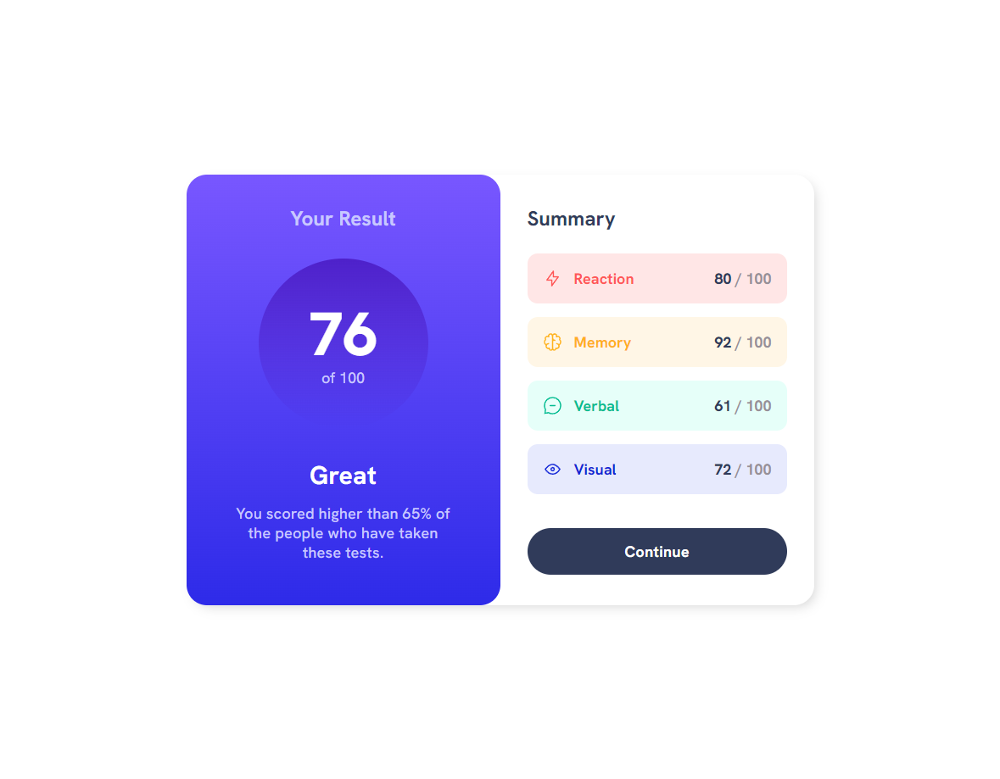

# Frontend Mentor - Results summary component solution

This is a solution to the [Results summary component challenge on Frontend Mentor](https://www.frontendmentor.io/challenges/results-summary-component-CE_K6s0maV). Frontend Mentor challenges help you improve your coding skills by building realistic projects. 

## Table of contents

- [Overview](#overview)
  - [The challenge](#the-challenge)
  - [Screenshot](#screenshot)
  - [Links](#links)
- [My process](#my-process)
  - [Built with](#built-with)
  - [What I learned](#what-i-learned)
- [Author](#author)

## Overview
- A responsive 'social proof section' built with HTML and CSS (flexbox)

### The challenge
- Build out this 'results summary' component to match the provided design spec

### Screenshot

### Links
- Live Site URL: 

## My process
- Utilized CSS Grid on the **body** element to vertically and horizontally center the component
- Used a *flex container* wrapper element to stack the two main sections with a *flex-direction* of 'column' on mobile, and then adjust to a *flex-direction* of 'row' for larger device sizes
- Used additional flexbox positioning in areas where I needed to get multiple elements to sit next to eachother and respond to screen resize
- Used one media query to adjust **flexbox** behavior, positoning, and spacing for larger devices

### Built with
- Semantic HTML5 markup
- CSS custom properties
- Flexbox
- CSS Grid

### What I learned
- How to work with CSS Gradients
- Practiced using various *flexbox* properties to create a responsive layout

## Author
- Ryan Hemrick